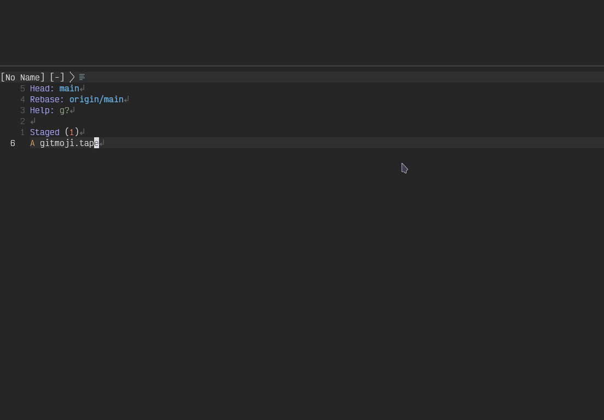

# gitmoji.nvim

[Gitmojis](https://gitmoji.dev/) for Neovim using [nvim-cmp](https://github.com/hrsh7th/nvim-cmp)



## Installation

You can install the plugin via [Lazy](https://github.com/folke/lazy.nvim) like this:
```lua
{
    "Dynge/gitmoji.nvim",
    dependencies = {
        "hrsh7th/nvim-cmp",
    },
    opts = {},
    ft = "gitcommit",
},
```

## Configuration

Configuration and setup is done by calling the `.setup()` method like so:

```lua
-- directly calling setup
require("gitmoji").setup({})

-- or using ´opts´ table in lazy table
{
    "Dynge/gitmoji.nvim",
    dependencies = {
        "hrsh7th/nvim-cmp",
    },
    opts = { -- the values below are the defaults
        filetypes = { "gitcommit" },
        completion = {
            append_space = false,
            complete_as = "emoji",
        },
    },
    ft = "gitcommit",
},
```

> **_Note:_**
For more details on the config options read the [help](./doc/gitmoji.txt) file.

Be sure to set the source into your nvim-cmp opts:

```lua
require("cmp").setup({
  sources = {
    { name = 'gitmoji' }
  })
})
```

## Usage

Gitmoji completion simply adds a `gitmoji` source to nvim-cmp setup.

The completion is triggered on the `:` character.

